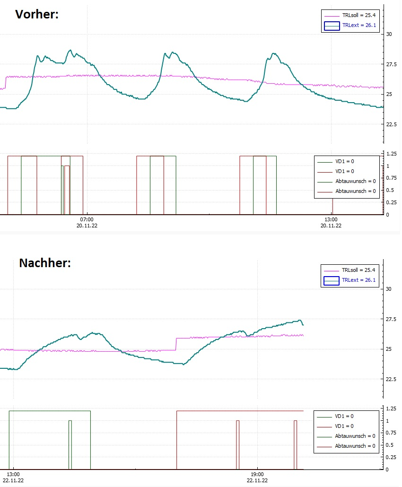

# Twin LWD 90
~Binary fixes for Alpha Innotec Luxtronic heat pump controller firmware~

This repository documents the patches to V4.81.2 of the Luxtronic Firmware that runs on installations using two LWD90 compressors and the hydraulic module HMD2.

The Luxtronic firmware is plagued by many bugs and this particular setup is no exception. Sadly, Alpha Innotec has long since stopped delivering improvements or fixes.

### Fix 1: HC Add-time limit too short (de: HRM-Zeit)

**Background**
The _'HC Add-time'_ timer increases while the return temperature remains below the lower hysteresis threshold of its target value (de: Rücklauf-Soll). If this timer exceeds 25 minutes of heating operation, the second compressor is activated. However, operating both compressors would require a flow rate of 4'000 litres per hour. Since no domestical hydraulic installation can be expected to support this insane amount of flow, the excess flow is diverted through the parallel buffer tank. This prematurely raises the return temperature above the hysteresis threshold, leading to an early shutdown of the system. Because the building itself has not been sufficiently heated (i.e. it remains cold), the return temperature quickly drops below hysteresis again, triggering a new heating cycle after only a short pause.

**Key issue 1:**
The key issue is that before the heating turns on, the system ***almost always*** waits for the duration of 1 off-time switch cycle (Schaltspielsperre SSP) which is 20 minutes, even if the system has been idle for over an hour, likely due to a bug. Unfortunately, the _'HC Add-time'_ timer continues to run during this waiting period. As a result, it already reaches around 20 minutes by the time heating resumes, leaving only about 5 minutes to raise the floor heating temperature before the second compressor is engaged.

As a result, the system is short-cycling on and off, which puts undue thermal stress on the components (multiple compressor starts instead of a single continuous run).

**Key issue 2:**
During periodic defrost cycles, the return temperature drops because the building supplies the energy required for this process. This however causes the _'HC Add-time'_ timer to accumulate several minutes during each defrost. During extended heating periods in winter, a single compressor may be sufficient to heat the building. However, after a few hours, the 25-minute limit is inevitably exceeded because the LWD90 performs a defrost cycle every 45–60 minutes. Engaging the second compressor interrupts this otherwise continuous run of the compressor and leads to short-cycling for the reasons described above.

**Solution**

Instead, the controller should allow more time for a single compressor to heat the system. The 25 minute limit must increase.

> Change HRM25 limit from 25 minutes (1500s / 0x05DC) to 115 minutes (6900s / 0x1AF4).
> At offset 0x1179D8, change bytes 0xDC05 to 0xF41A

    001179B0  38 79 1D 00 39 79 1D 00 3A 79 1D 00 3B 79 1D 00
    001179C0  3C 79 1D 00 30 1E 1E 00 28 79 1D 00 2C 79 1D 00
    001179D0  30 79 1D 00 34 79 1D 00 DC 05 00 00 98 1C 1E 00
    001179E0  20 1C 00 00 00 48 2D E9 04 B0 8D E2 58 30 9F E5
    001179F0  00 30 D3 E5 04 00 53 E3 01 00 00 1A 67 FF FF EB

becomes

    001179B0  38 79 1D 00 39 79 1D 00 3A 79 1D 00 3B 79 1D 00
    001179C0  3C 79 1D 00 30 1E 1E 00 28 79 1D 00 2C 79 1D 00
    001179D0  30 79 1D 00 34 79 1D 00 F4 1A 00 00 98 1C 1E 00
    001179E0  20 1C 00 00 00 48 2D E9 04 B0 8D E2 58 30 9F E5
    001179F0  00 30 D3 E5 04 00 53 E3 01 00 00 1A 67 FF FF EB

Attention: In Luxtronik GUI, you must configure 'release 2hg' (de: Freig. ZWE) to 120 minutes!

This fix significantly improves runtime behavior:

### Disclaimer

Do not deviate from any of the values in this document to avoid unintended side effects.

This information is provided solely for educational purposes. No representations or warranties are made regarding its accuracy, completeness, or suitability for any purpose. Use of this information is at your own risk and may result in damage to equipment.
