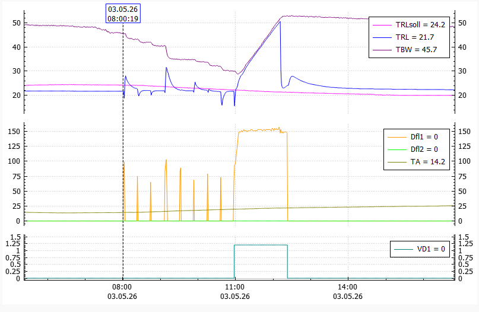
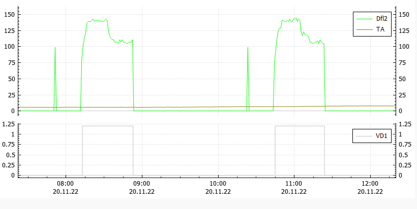

# AIT Twin LWD 90 Fixes
.: Binary fixes for Alpha Innotec Luxtronic heat pump controller firmware :.

This repository documents the patches to V4.81.2 of the Luxtronic Firmware that runs on installations using two LWD90 compressors and the hydraulic module HMD2.

The Luxtronic firmware is plagued by many bugs and this particular setup is no exception. Sadly, Alpha Innotec has long since stopped delivering improvements or fixes.

## Fix: 'HC Add-time' limit too short (de: HRM-Zeit)

> Change HRM25 limit from 25 minutes (1500s / 0x05DC) to 115 minutes (6900s / 0x1AF4).
> At offset 0x1179D8, change bytes 0xDC05 to 0xF41A:

    001179B0  38 79 1D 00 39 79 1D 00 3A 79 1D 00 3B 79 1D 00
    001179C0  3C 79 1D 00 30 1E 1E 00 28 79 1D 00 2C 79 1D 00
    001179D0  30 79 1D 00 34 79 1D 00 DC 05 00 00 98 1C 1E 00
    001179E0  20 1C 00 00 00 48 2D E9 04 B0 8D E2 58 30 9F E5
    001179F0  00 30 D3 E5 04 00 53 E3 01 00 00 1A 67 FF FF EB

becomes

    001179B0  38 79 1D 00 39 79 1D 00 3A 79 1D 00 3B 79 1D 00
    001179C0  3C 79 1D 00 30 1E 1E 00 28 79 1D 00 2C 79 1D 00
    001179D0  30 79 1D 00 34 79 1D 00 F4 1A 00 00 98 1C 1E 00
    001179E0  20 1C 00 00 00 48 2D E9 04 B0 8D E2 58 30 9F E5
    001179F0  00 30 D3 E5 04 00 53 E3 01 00 00 1A 67 FF FF EB

**Attention:** In Luxtronik GUI, you must configure 'release 2hg' (de: Freig. ZWE) to 120 minutes!

**Background**
The _'HC Add-time'_ timer increases while the return temperature remains below the lower hysteresis threshold of its target value (de: Rücklauf-Soll). If this timer exceeds 25 minutes of heating operation, the second compressor is activated. However, operating both compressors would require a flow rate of 4'000 litres per hour. Since no domestical hydraulic installation can be expected to support this insane amount of flow, the excess flow is diverted through the parallel buffer tank. This prematurely raises the return temperature above the hysteresis threshold, leading to an early shutdown of the system. Because the building itself has not been sufficiently heated (i.e. it remains cold), the return temperature quickly drops below hysteresis again, triggering a new heating cycle after only a short pause.

**Key issue 1:**
The key issue is that before the heating turns on, the system ***almost always*** waits for the duration of 1 off-time switch cycle (Schaltspielsperre SSP) which is 20 minutes, even if the system has been idle for over an hour, likely due to a bug. Unfortunately, the _'HC Add-time'_ timer continues to run during this waiting period. As a result, it already reaches around 20 minutes by the time heating resumes, leaving only about 5 minutes to raise the floor heating temperature before the second compressor is engaged.

As a result, the system is short-cycling on and off, which puts undue thermal stress on the components (multiple compressor starts instead of a single continuous run).

**Key issue 2:**
During periodic defrost cycles, the return temperature drops because the building supplies the energy required for this process. This however causes the _'HC Add-time'_ timer to accumulate several minutes during each defrost. During extended heating periods in winter, though a single compressor may be sufficient to heat the building, after a few hours, the 25-minute limit is inevitably exceeded because the LWD90 performs a defrost cycle every 45–60 minutes. Engaging the second compressor interrupts this otherwise continuous run of the compressor and leads to short-cycling for the reasons described above.

**Solution**

Instead, the controller should allow more time for a single compressor to heat the system. The 25 minute limit must increase.

This fix significantly improves runtime behavior:

## Fix: Compressor-heating mismatch

> 1. Change compressor heater minimum temperature from 35.0° (0x15E) to 33.0° (0x14A)
> At offset 0x055228, change byte 0x5E to 0x4A
>
> 2. Change target temperature offset from from 30.0° (0x12C) to 28.0° (0x118)
> At offset 0x0551F4, change byte 0x4B to 0x46 (ARM 8-bit immediate enconding)

    000551D0  14 D0 4D E2 10 00 0B E5 00 30 A0 E3 0C 30 0B E5
    000551E0  40 30 9F E5 08 30 0B E5 10 30 1B E5 04 31 93 E5
    000551F0  00 30 93 E5 4B 3F 83 E2 0C 30 0B E5 0C 20 1B E5
    00055200  08 30 1B E5 03 00 52 E1 01 00 00 AA 08 30 1B E5
    00055210  0C 30 0B E5 0C 30 1B E5 03 00 A0 E1 00 D0 8B E2
    00055220  00 08 BD E8 1E FF 2F E1 5E 01 00 00 04 B0 2D E5
    00055230  00 B0 8D E2 0C D0 4D E2 08 00 0B E5 08 30 1B E5
    00055240  24 30 93 E5 31 00 53 E3 0F 00 00 0A 08 30 1B E5

becomes:

    000551D0  14 D0 4D E2 10 00 0B E5 00 30 A0 E3 0C 30 0B E5
    000551E0  40 30 9F E5 08 30 0B E5 10 30 1B E5 04 31 93 E5
    000551F0  00 30 93 E5 46 3F 83 E2 0C 30 0B E5 0C 20 1B E5
    00055200  08 30 1B E5 03 00 52 E1 01 00 00 AA 08 30 1B E5
    00055210  0C 30 0B E5 0C 30 1B E5 03 00 A0 E1 00 D0 8B E2
    00055220  00 08 BD E8 1E FF 2F E1 4A 01 00 00 04 B0 2D E5
    00055230  00 B0 8D E2 0C D0 4D E2 08 00 0B E5 08 30 1B E5
    00055240  24 30 93 E5 31 00 53 E3 0F 00 00 0A 08 30 1B E5

**Background**

In V4.81.2, the idle compressor heating target is defined as:

    target = [Condensing Temperature] + 30.0°C
    if (target < 35.0°C)
        target = 35.0°C

The Luxtronic controller firmware checks the compressor heater temperature sensor and allows compressor operation only if the measured temperature is **above** this target.

However the compressor heater itself is not controlled by the Luxtronic controller, but by the firmware inside the LWD90 outdoor unit. This firmware applies a negative hysteresis of -1°C: it switches off the compressor heater once the target temperature is reached and only reactivates it when the temperature drops to -1°C **below** the target.

In theory, this means the start condition could never be met.

In practice, after the compressor heating phase ends, the measured temperature overshoots slightly due to thermal insulation around the compressor. This creates a brief window during which the Luxtronic controller considers the compressor ready and permits operation. Additionally, in a twin-compressor system, the likelihood increases that at least one compressor happens to be within the acceptable range. This effectively masks the underlying flaw in the control logic (as is the case with many other things in domestic heating).

So there you have it: It is largely by coincidence that your Alpha Innotec twin heat pump is working at all.

Here is a particulary annoying example of this behavior: the controller attempts to heat domestic hot water starting at 08:00, but the process is delayed until much later in the day, while the storage tank continues to deplete. After each attempt, the system then waits for 20 minutes (1 off-time switch cycle):

In most cases, the effects of this bug are less pronounced and typically appear only as brief delays (“single ticks”) before operation begins:

The key issue is that achieving maximum efficiency and cost-effectiveness when tuning heat pump parameters requires reliable and predictable control behavior.

**Solution**

Adjust the compressor heater target temperature calculcation of the Luxtronik controller to a lower value.

**Note**: This patch does **not** affect the actual temperature of the compressor heater. The LWD90 outdoor unit continues heating the compressor to the original target value. Rather, the Luxtronik controller now respects the temperature hysteresis.

### How to patch

The _wp2reg-V4.81.2_ firmware file is a nested .tar.gz archive. Apply the binary patches to:

> wp2reg-V4.81.2/wp2reg-AlphaInnotech-prod/home.wp2reg-V4.81.2/appl

Repackage carefully and update the MD5 hash of _home.wp2reg-V4.81.2_:

> wp2reg-V4.81.2/wp2reg-AlphaInnotech-prod/home.wp2reg-V4.81.2.md5

I purposely omit specific commands because at this stage _you_ need to be 100% sure you handle these files correctly!

Tip: You can overwrite a character in the language file of your choice to mark a modified version of the firmware.

### Disclaimer

Do not deviate from any of the values in this document to avoid unintended side effects.

This information is provided solely for educational purposes. No representations or warranties are made regarding its accuracy, completeness, or suitability for any purpose. Use of this information is at your own risk and may result in damage to equipment.
